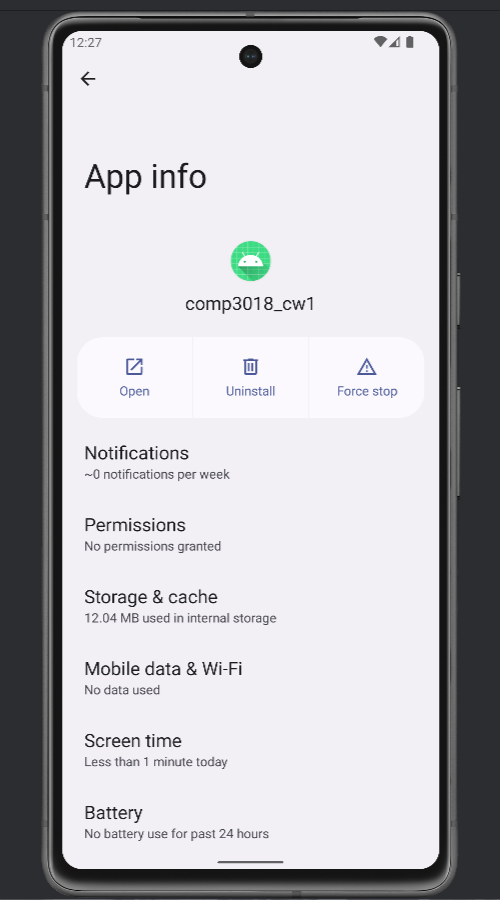
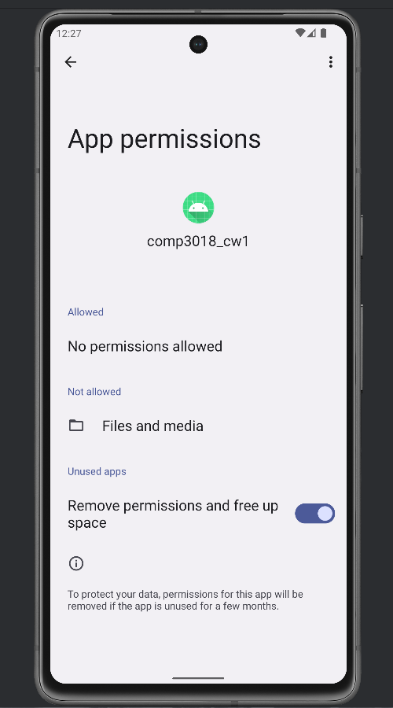
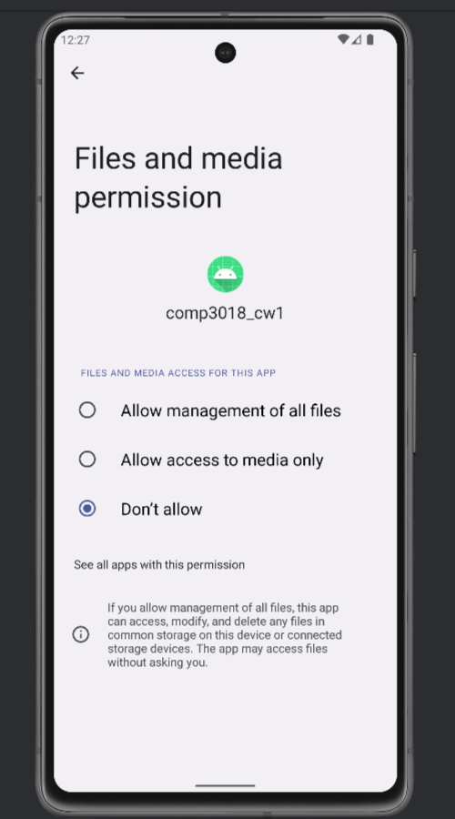
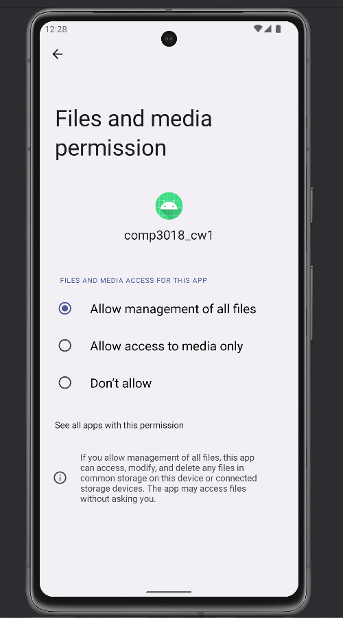
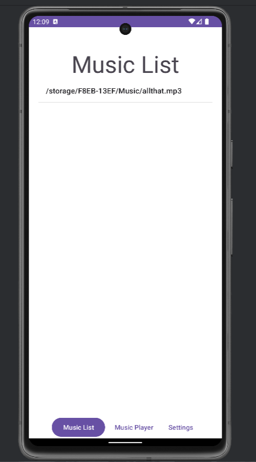
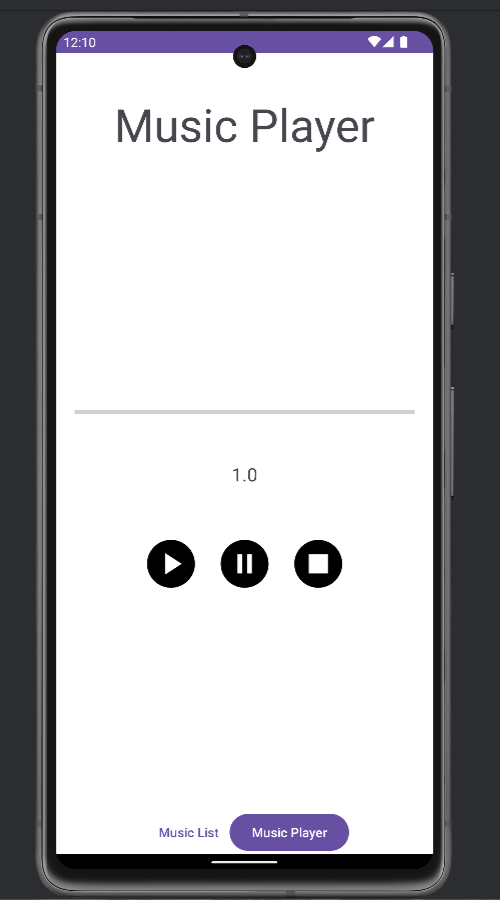
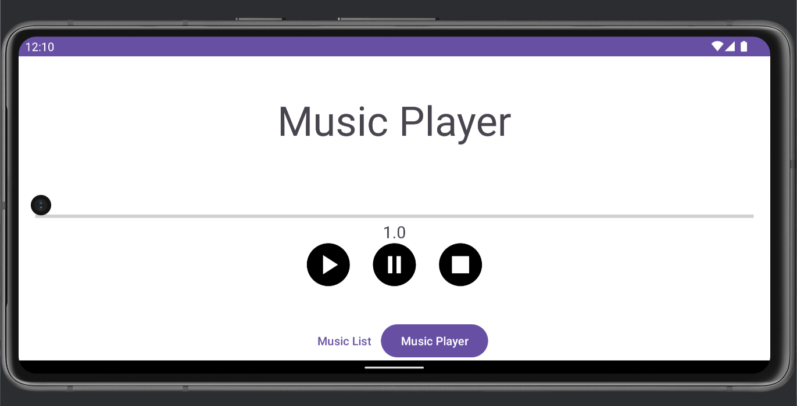
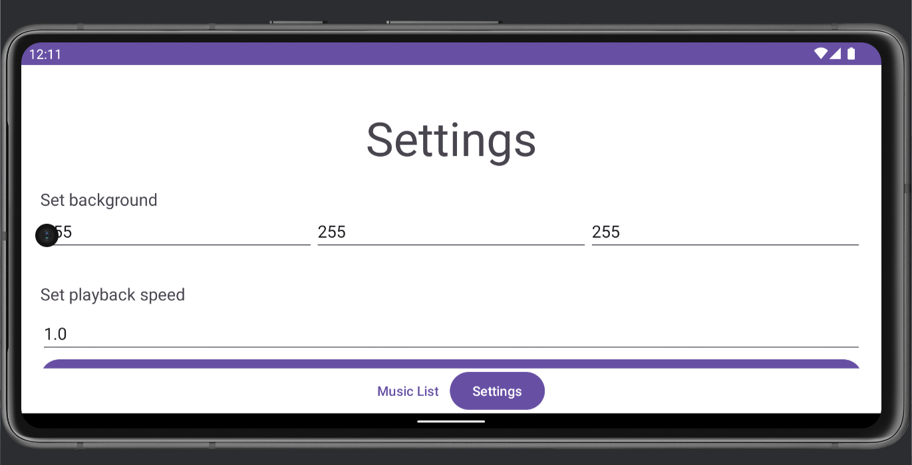
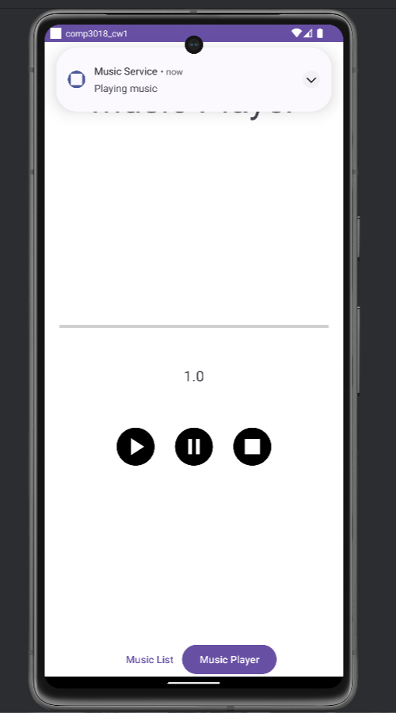

# Music Player

## Brief project description

An application with the functionality of a simple music player for Android, 
which allows users to select from a number of music files stored on the SD card storage of the  device to be played, 
and allows the music to continue to play in the background while the user performs other tasks.

The application consists of three Activity components:
- An activity displaying all the tracks available on the device which can be played. (Music list)
  - Displays and allows the user to select from and play music files from the /sdcard/Music
- An activity that has the play / pause / stop buttons alongside a display of the current progress of the currently playing song,
and the current playback speed (Music player)
  - Allows the user to stop or pause playback, and select the next or previous track
  - Displays the current progress of the playback (i.e. the elapsed time)
- An activity where the settings which control playback speed and background color can be set (Settings). 
  - Specify the value for playback speed 
- A Service that provides continued playback in the background
- A Notification that that is displayed while the music is playing

## How to install and run the project

### Installation

- The apk file can be dragged onto an emulator or connected physical device.
- The project can be cloned & ran on an emulator or connected physical device.

### Setup

- In the app info you will need to grant permissions
- Permissions > Files and media
- Allow management of all files  > Allow

  
  
  
  
  

## The project

The app itself consists of three screens

  
  
  

All screens are also responsive to landscape mode

  
  
  

When an mp3 is selected from the music list a notification is shown

  
  

